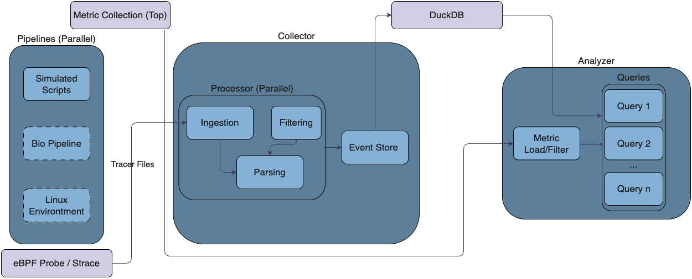

# TraceProto

This repository contains an observability pipeline that simulates, collects, processes, and analyzes system-level signals using `strace` and `eBPF`.

---

## Table of Contents

1. [Overview](#1-overview)  
2. [Architecture](#2-architecture)  
3. [How to Run](#3-how-to-run)  
4. [Component Breakdown](#4-component-breakdown)  
5. [Design Decisions](#5-design-decisions)
6. [Query Construction](#6-query-construction)
7. [Dependencies](#7-dependencies)  
8. [Challenges and Future Work](#8-challenges-and-future-work)  
9. [Test Environment & Results](#9-test-environment--results)  

---

## 1. Overview

The system is designed to:
- Collect execution traces and CPU/memory usage from simulated workloads
- Structure the collected data into a queryable format
- Provide two key insights:
  1. Average execution time per system binary
  2. Top 3 binaries ranked by CPU usage

It uses:
- **Python 3.10+** for coordination and analysis
- **`strace`** and **`bpftrace`** for signal collection
- **`top`** for live system-wide CPU/memory sampling
- **DuckDB** for structured data storage and querying

---

## 2. Architecture

The pipeline consists of four main components:

1. **Pipelines**  
    Bash scripts that simulate system activity using a variety of standard commands (e.g., `dd`, `top`, `yes`).

2. **Collector** (`collector.py`)  
   Uses `strace` or `eBPF` to record all `execve()` system calls, and samples CPU/memory stats using `top`. It saves traces and metrics per run.

3. **Processor** (`processor.py`)  
   Parses raw trace files and metrics. Converts them into structured `Event` records and stores them in `events.duckdb`.

4. **Queries** (`queries.py`)  
   Runs Tracer's required queries on the structured data and exports the results as CSV files.




---

## 3. How to Run

```bash
make strace     # runs strace collection + processing + analysis
make ebpf       # runs ebpf collection + processing + analysis
make clean      # removes the data directory
```

Each run creates a new session folder inside `data/` containing:
- Raw traces (`*-trace.txt` or `*.txt.<pid>`)  
- CPU/mem metrics (`*-metrics.csv`)
- `events.duckdb` (structured event table)
- Query outputs:
  - `query1_avg_duration.csv`
  - `query2_cpu_hours.csv`

---

## 4. Component Breakdown

### Component 1: Signal Collection
- Uses `strace -ff -tt` to trace `execve()` and record child processes
- Uses `bpftrace` to record system-wide `execve` events
- Samples CPU/mem system-wide using `top -b -n 1 -d 0.1`
- Stores each pipeline run's metrics and trace in a separate file

### Component 2: Agent Architecture
- Processing pipeline: ingestion → parsing → filtering → storage
- Multi-threaded file parsing via `ThreadPoolExecutor`
- Clean separation of strace vs eBPF parsers
- Extensible design for new signal types or output formats

### Component 3: Query Implementation
- **Query 1:** Average execution duration per command, based on start/end timestamps from strace logs
- **Query 2:** CPU hours per command, by joining `events` and filtered `top` metrics via PID

Results are written to CSV for submission clarity.

---

## 5. Design Decisions

### Collector (`collector.py`)
- **Mode-based collection:** Supports both `strace` and `eBPF` modes via CLI flag, enabling future integration with tools like `perf`, `ptrace`, or custom eBPF probes.
- **Process-level trace separation:** Uses `strace -ff` to generate one trace file per PID, supporting clean duration extraction and better event traceability.
- **System-wide sampling:** Runs `top` globally at high frequency (every 0.1s) during pipeline execution, capturing per-process CPU and memory metrics.
- **Session management:** Automatically generates a timestamped session folder per run, containing all traces, metrics, and results.
- **Extensibility:** Modular design allows easy integration of new metrics sources or tracing tools by adding new `--mode` entries.

### Processor (`processor.py`)
- **Event unification:** All trace and metric data is parsed into a unified `Event` class with support for fields like `pid`, `command`, `timestamp`, and `duration_sec`.
- **Per-mode parsing:** Separate parsers for `strace` and `eBPF` support specialized logic (e.g., SIGTERM detection in strace, argument extraction in eBPF).
- **Parallel parsing:** Uses `ThreadPoolExecutor` for parallel trace file parsing, improving performance and scalability.
- **Filtering hook:** Includes a `filter_event()` function for future filtering of irrelevant events (e.g., shells, system daemons). It is currently unused but designed for extensibility.

### Queries (`queries.py`)
- **Low-noise CPU usage:** Filters out samples with less than 1% CPU to reduce background noise and focus on meaningful execution.
- **PID-level metric joining:** Joins system-wide top output with parsed events via PID, allowing real CPU attribution.
- **CSV output:** Writes both query results to CSV files (`query1_avg_duration.csv`, `query2_cpu_hours.csv`) inside the session directory for easy inspection.
- **Query separation:** Each query is encapsulated in a dedicated function to run independently.

---

## 6. Query Construction

### Query 1 – Average Execution Duration per Command
- **Source:** `events.duckdb`, generated from `strace` mode
- **Fields used:** `command`, `timestamp_start`, `duration_sec`
- **Logic:**
  - Each PID has exactly one `Event` with a `duration_sec` computed from the difference between the first `execve()` and the last observed event (typically `+++ killed by SIGTERM +++`)
  - Grouped by `command`, and averaged across all processes
- **Assumptions:**
  - We assume one main binary per pipeline trace and accurate end markers in strace

### Query 2 – Top Commands by CPU Usage
- **Sources:** `events.duckdb`, merged with `*-metrics.csv`
- **Fields used:** `pid`, `command` (from events), `cpu_percent` (from metrics)
- **Logic:**
  - Metrics sampled system-wide using `top`, filtered to include only PIDs traced during collection
  - Samples <1% CPU were excluded to reduce noise
  - CPU usage per sample is normalized by interval and aggregated by command
- **Assumptions:**
  - Sampling interval is 0.1s, and CPU percentage is normalized across 100% per core

---

## 7. Dependencies

- Python 3.10+
- `strace`
- `bpftrace`
- `top`
- Python packages:
  - pandas
  - duckdb
  - duckdb
  - numpy
  - pandas
  - psutil
  - python-dateutil
  - pytz
  - six
  - tzdata

Install Python dependencies:
```bash
pip install -r requirements.txt
```

---

## 8. Challenges and Future Work

### Challenges

- **eBPF duration tracking limitations:** The current implementation only hooks into `sys_enter_execve`, which does not expose process exits. This prevents duration tracking for eBPF-based events.
- **Short-lived process visibility:** Some binaries execute and terminate in under 100ms. Even with 0.1s sampling, we may miss brief process activity.
- **System-level noise:** On small instances like `t2.micro`, background OS activity may interfere with accurate metric collection, particularly when using `top` system-wide.

### Future Work

- eBPF parallel pipeline
- Extend eBPF collection to infer binary end times
- Add memory usage aggregation per binary
- Implement anomaly detection, and warning raise mechanism
- Complete filter_event support
- Add bioinformatics pipeline
- Export DuckDB queries to a web dashboard for real-time insight

---

## 9. Test Environment & Results

All components were tested in a live environment on an AWS EC2 instance:

- **Platform:** AWS EC2
- **Instance type:** t3.micro (Free Tier)
- **OS:** Ubuntu 22.04 LTS

During testing, I ran both `make strace` and `make ebpf` to validate pipeline correctness. Example outputs (including screenshots of terminal sessions and result files) can be found in the `docs/screenshots/` directory:

- `make strace` execution
- `duckdb` CLI preview of `events`
- `query1_avg_duration.csv` preview
- `query2_cpu_hours.csv` preview

These demonstrate that the full data pipeline executed correctly and produced meaningful outputs from real trace + metrics data.